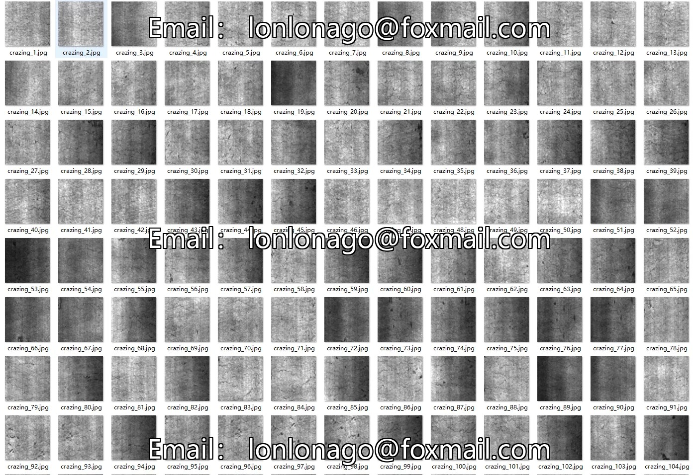
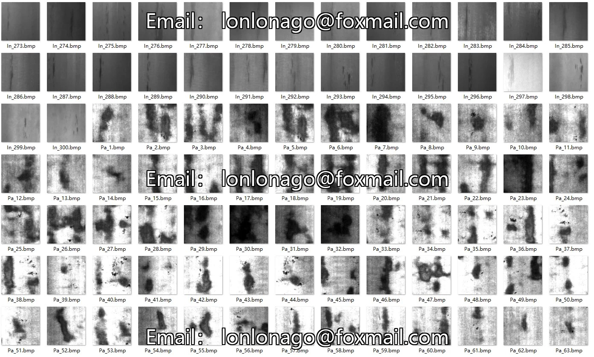
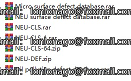
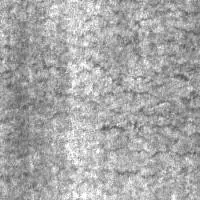
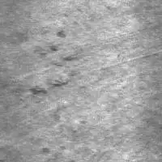

## Body

（NEU 数据集完整版）经典热轧钢板表面缺陷数据集

NEU surface defect database.rar	原始完整数据集，含 6 类缺陷的全部原始图  做数据增强、自定义标注、多任务通用

NEU-CLS.rar / NEU-CLS-1.rar	分类任务专用版本，按类别分好文件夹	直接用于 ResNet、VGG 等分类模型训练

NEU-CLS-64.zip	64×64 分辨率裁剪版，轻量分类数据	低算力设备、快速原型验证、轻量模型训练

NEU-DEF.zip	目标检测专用版本，带 XML 格式边界框标注	直接用于 YOLO、Faster R-CNN 等检测模型训练

Micro surface defect database.rar	微小缺陷扩展数据集，含 6×6 像素级超小缺陷样本  高难度缺陷检测、小目标检测算法测试

Oil pollution defect database.rar	油污干扰场景扩展数据集，模拟工业油污遮挡  抗干扰缺陷检测、复杂工况算法验证

电子虚拟产品售出概不退换

## Images

Here is a pay link on Stripe ( https://buy.stripe.com/3cs8yP7sY87d0vu9AB ). Please contact me lonlonago@foxmail.com after funding $89, and I will send you a complete data files , thank you!

